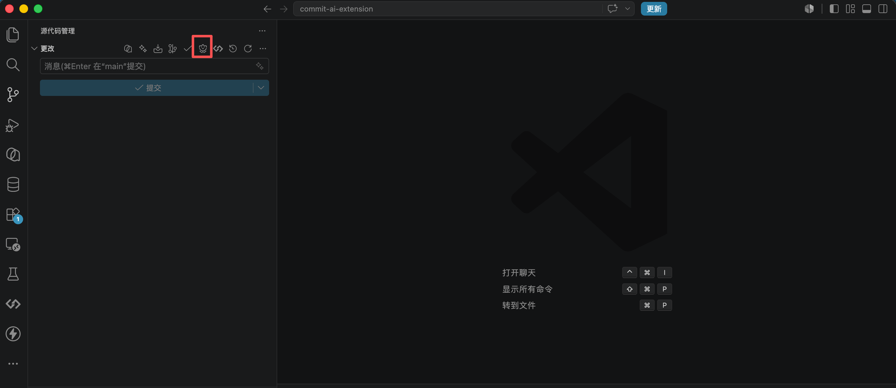

# AI-Powered Commits

Generate concise, commitlint-friendly Git commit messages from your current VS Code Git changes.



## Features

- Generate messages from staged, unstaged, or all Git changes
- Write results directly to the Source Control commit input
- Produce emoji Conventional Commits compatible with commitlint
- Support Chinese, English, and bilingual output
- Use OpenAI, DeepSeek, Qwen, Ollama, or custom OpenAI-compatible APIs
- Store API keys with VS Code SecretStorage

## Quick Start

1. Open a Git repository with local changes.
2. Configure a provider in VS Code settings.
3. Run `Commit AI: Set API Key` for cloud providers.
4. Click the flower icon in Source Control, or run `Commit AI: Generate Commit Message`.
5. Review the generated message and commit.

Whitespace-only changes are detected locally and do not call an AI provider.

## Commands

- `Commit AI: Generate Commit Message`
- `Commit AI: Set API Key`
- `Commit AI: Clear API Key`
- `Commit AI: Change Language`
- `Commit AI: Change Style`

## Settings

- `commitAI.language`: `zh-CN`, `en-US`, or `bilingual`
- `commitAI.style`: `emojiConventional`, `simple`, `conventional`, or `detailed`
- `commitAI.provider`: `openai`, `deepseek`, `qwen`, `ollama`, or `custom`
- `commitAI.model`: default `gpt-4o-mini`; provider defaults are used when this remains unchanged
- `commitAI.apiBaseUrl`: optional provider base URL
- `commitAI.maxDiffLength`: default `12000`
- `commitAI.diffMode`: `auto`, `staged`, `unstaged`, or `all`
- `commitAI.showPreview`: default `false`; generated messages are written directly to the Git commit input

## Provider Defaults

- OpenAI: `https://api.openai.com/v1`, model `gpt-4o-mini`
- DeepSeek: `https://api.deepseek.com`, model `deepseek-chat`
- Qwen: `https://dashscope-intl.aliyuncs.com/compatible-mode/v1`, model `qwen-plus`
- Ollama: `http://localhost:11434`, model `llama3.1`
- Custom: requires `commitAI.apiBaseUrl`

For Qwen China Beijing, set `commitAI.apiBaseUrl` to:

```txt
https://dashscope.aliyuncs.com/compatible-mode/v1
```

For Qwen US Virginia, set:

```txt
https://dashscope-us.aliyuncs.com/compatible-mode/v1
```

## Default Commit Format

The default style is `emojiConventional`, which uses:

```txt
<type>(<scope>): <emoji> <subject>

- <what/why point 1>
- <what/why point 2>
```

Example:

```txt
chore(config): 🔧 添加 API 文档地址配置

- 新增 UMI_APP_API_DOCS_URL 开发环境变量
```

## Development

```bash
npm install
npm run compile
npm run package
```

Open this folder in VS Code and press F5 to launch the Extension Development Host.

## Notes

The stable release uses the Source Control title bar button. VS Code's Source Control input-box inline menu currently requires a proposed API and is not enabled in the packaged release.
